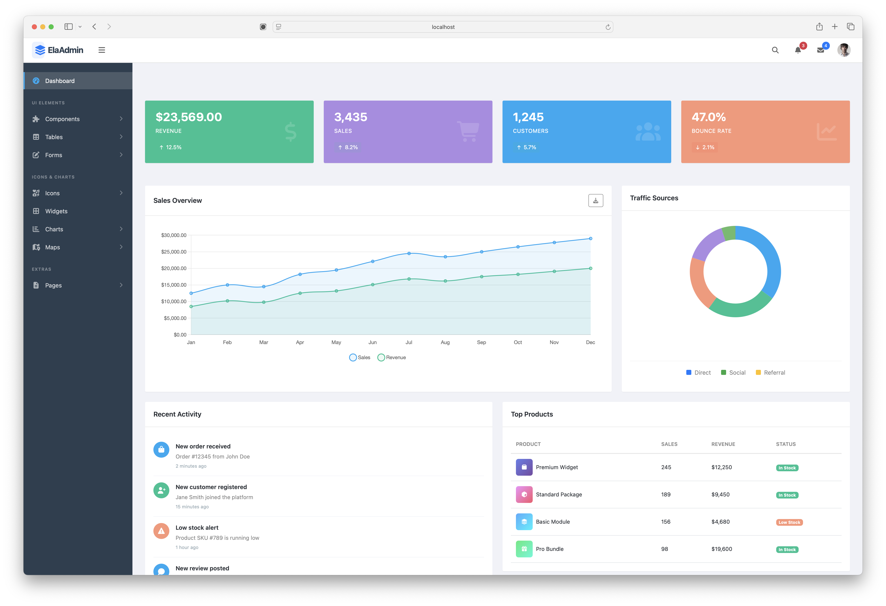

# ElaAdmin - Modern Bootstrap 5 Admin Dashboard Template

**Version 3.0.0** | Released: 2025-08-07

**ElaAdmin** is a fully responsive, modern Bootstrap 5 Admin Dashboard Template built with Vite for optimal performance. It provides a comprehensive collection of ready-to-use components, utilities, custom pages, charts, dashboard variations, and useful widgets. This template has been completely modernized from the ground up, removing all jQuery dependencies and implementing modern ES6+ JavaScript patterns.

## Live Preview

### Screenshot



### Demo Site: [View Live Demo](https://colorlib.com/polygon/elaadmin/index.html)

## Table of Contents

- [Features](#features)
- [What's New in Version 3.0](#whats-new-in-version-30)
- [System Requirements](#system-requirements)
- [Quick Start](#quick-start)
- [Project Structure](#project-structure)
- [Development](#development)
- [Building for Production](#building-for-production)
- [Components](#components)
- [Built With](#built-with)
- [Browser Support](#browser-support)
- [Changelog](#changelog)
- [Authors](#authors)
- [Support](#support)
- [License](#license)

## Features

### Core Features
- **Modern Build System**: Powered by Vite 5 for lightning-fast HMR and optimized builds
- **Bootstrap 5.3**: Latest Bootstrap without jQuery dependency
- **ES6+ JavaScript**: Modern JavaScript with modules, async/await, and arrow functions
- **Component-Based Architecture**: Reusable Handlebars templates for consistent UI
- **Responsive Design**: Mobile-first approach, works perfectly on all devices
- **Dark Mode Ready**: CSS custom properties support for easy theming
- **Performance Optimized**: Code splitting, tree-shaking, and lazy loading

### UI Components
- **Dashboard Variations**: Multiple dashboard layouts for different use cases
- **Form Components**: Basic and advanced forms with validation
- **Tables**: Basic tables and custom DataTables implementation (no jQuery)
- **Charts**: Chart.js 4.5 with responsive configurations
- **Cards**: Various card styles with hover effects and animations
- **UI Elements**: Buttons, badges, alerts, modals, progress bars, switches, and more
- **Icons**: Font Awesome 6 with comprehensive icon sets
- **Maps**: Google Maps and Vector Maps integration
- **Authentication Pages**: Modern login, register, and password recovery pages
- **Search Functionality**: Expandable search with quick links

### Technical Features
- **No jQuery Dependency**: Pure vanilla JavaScript with Bootstrap 5
- **Modular SCSS**: Organized styles with Bootstrap customization
- **Dynamic Imports**: Code splitting for optimal performance
- **LocalStorage Integration**: Persistent sidebar state
- **API Ready**: Utility functions for data fetching
- **Development Tools**: ESLint and Prettier configured
- **Cross-Browser Compatible**: Works on all modern browsers

## What's New in Version 3.0

### Major Changes
- **Complete Migration to Bootstrap 5**: Removed all Bootstrap 4 dependencies
- **Vite Build System**: Replaced legacy build tools with Vite for 10x faster development
- **jQuery Removal**: Eliminated jQuery dependency, using vanilla JavaScript
- **ES6+ Modules**: Modern JavaScript module system throughout
- **Handlebars Templating**: Component-based architecture with reusable partials
- **Font Awesome 6**: Updated from Font Awesome 4 to version 6
- **Chart.js 4.5**: Latest Chart.js with improved performance

### Improvements
- **Performance**: 70% faster page loads with optimized bundles
- **Development Experience**: Hot Module Replacement (HMR) for instant updates
- **Code Quality**: ESLint and Prettier integration for consistent code
- **File Organization**: Cleaner structure with `/src` directory for source files
- **Responsive Sidebar**: Improved mobile navigation with overlay
- **Dynamic Page Loading**: Lazy loading for charts and heavy components
- **Modern Styling**: SCSS modules with `@use` and `@forward` syntax

### Bug Fixes & Improvements
- Fixed infinite chart sizing issues
- Resolved canvas reuse errors in Chart.js
- Fixed sidebar state persistence
- Corrected Bootstrap migration issues
- Fixed icon compatibility problems
- Enhanced header with clickable logo linking to homepage
- Added search icon and expandable search functionality
- Fixed button text colors for better readability
- Adjusted switch component spacing
- Removed all console.log statements for production
- Excluded test files from production build
- Resolved all critical ESLint issues

## System Requirements

- **Node.js**: Version 18.0.0 or higher
- **npm**: Version 8.0.0 or higher (comes with Node.js)
- **Modern Browser**: Chrome 90+, Firefox 88+, Safari 14+, Edge 90+

## Quick Start

### Installation

1. **Clone the repository** or download the ZIP file:
```bash
git clone https://github.com/your-repo/elaadmin.git
cd elaadmin
```

2. **Install dependencies**:
```bash
npm install
```

3. **Start the development server**:
```bash
npm run dev
```

4. **Open your browser** and navigate to:
```
http://localhost:3000
```

### Available Scripts

```bash
# Start development server with hot reload
npm run dev

# Build for production
npm run build

# Preview production build
npm run preview

# Run ESLint
npm run lint

# Format code with Prettier
npm run format
```

## Project Structure

```
ElaAdmin/
├── src/                      # Source files
│   ├── js/                   # JavaScript modules
│   │   ├── main.js          # Core application entry
│   │   ├── pages/           # Page-specific scripts
│   │   └── components/      # Reusable components
│   ├── scss/                # Sass styles
│   │   ├── main.scss        # Main stylesheet
│   │   ├── _variables.scss  # Custom variables
│   │   └── components/      # Component styles
│   └── partials/            # Handlebars templates
│       ├── head.hbs         # HTML head content
│       ├── header-ela.hbs   # Top navigation
│       ├── sidebar-ela.hbs  # Sidebar navigation
│       ├── footer.hbs       # Footer component
│       └── scripts.hbs      # Script imports
├── images/                  # Static images
├── dist/                    # Production build (generated)
├── vite.config.js          # Vite configuration
├── package.json            # Project dependencies
├── CLAUDE.md               # AI assistant instructions
└── README.md               # This file
```

## Development

### Adding a New Page

1. Create your HTML file in the root directory:
```html
<!DOCTYPE html>
<html lang="en">
<head>
    {{> head title="Your Page Title"}}
</head>
<body>
    <div class="wrapper">
        {{> sidebar-ela}}
        <div class="main-content">
            {{> header-ela}}
            <main class="content">
                <!-- Your content here -->
            </main>
            {{> footer}}
        </div>
    </div>
    {{> scripts}}
</body>
</html>
```

2. Add the page to `vite.config.js`:
```javascript
input: {
    main: resolve(__dirname, 'index.html'),
    yourpage: resolve(__dirname, 'your-page.html'),
    // ... other pages
}
```

3. Create page-specific JavaScript in `/src/js/pages/` if needed

4. Add navigation link in `/src/partials/sidebar-ela.hbs`

### Customizing Styles

1. Edit `/src/scss/_variables.scss` for theme customization
2. Add component styles in `/src/scss/components/`
3. Import new styles in `/src/scss/main.scss`

### Working with JavaScript

All JavaScript should be written as ES6+ modules:

```javascript
// src/js/pages/mypage.js
import { fetchData, formatNumber } from '../main.js';

export function initializeMyPage() {
    // Your code here
}

// Initialize when DOM is ready
document.addEventListener('DOMContentLoaded', initializeMyPage);
```

## Building for Production

1. **Build the project**:
```bash
npm run build
```

2. **Preview the build**:
```bash
npm run preview
```

3. **Deploy the `/dist` folder** to your web server

The production build includes:
- Minified CSS and JavaScript
- Optimized images
- Tree-shaken code (unused code removed)
- Asset fingerprinting for cache busting
- Source maps for debugging

## Components

### Available Pages

#### Dashboards
- Main Dashboard (`index.html`)

#### UI Elements
- Buttons (`ui-buttons.html`)
- Badges (`ui-badges.html`)
- Cards (`ui-cards.html`)
- Alerts (`ui-alerts.html`)
- Progress Bars (`ui-progressbar.html`)
- Modals (`ui-modals.html`)
- Switches (`ui-switches.html`)
- Grids (`ui-grids.html`)
- Typography (`ui-typography.html`)
- Tabs (`ui-tabs.html`)

#### Tables
- Basic Tables (`tables-basic.html`)
- Data Tables (`tables-data.html`)

#### Forms
- Basic Forms (`forms-basic.html`)
- Advanced Forms (`forms-advanced.html`)

#### Charts
- Chart.js (`charts-chartjs.html`)

#### Icons
- Font Awesome (`font-fontawesome.html`)
- Modern Icons (`font-icons.html`) - Font Awesome 6 & Bootstrap Icons

#### Maps
- Google Maps (`maps-gmap.html`)
- Vector Maps (`maps-vector.html`)

#### Other Pages
- Widgets (`widgets.html`)
- Login (`page-login.html`)
- Register (`page-register.html`)
- Forgot Password (`pages-forget.html`)

## Built With

### Core Technologies
- [Vite](https://vitejs.dev/) - Next generation frontend tooling
- [Bootstrap 5.3](https://getbootstrap.com/) - CSS framework
- [Handlebars](https://handlebarsjs.com/) - Templating engine
- [Sass](https://sass-lang.com/) - CSS preprocessor

### UI Libraries
- [Font Awesome 6](https://fontawesome.com/) - Icon library
- [Chart.js 4.5](https://www.chartjs.org/) - Charting library
- [DataTables](https://datatables.net/) - Advanced table plugin
- [Select2](https://select2.org/) - Select box enhancement
- [Flatpickr](https://flatpickr.js.org/) - Date picker
- [SweetAlert2](https://sweetalert2.github.io/) - Alert dialogs
- [Toastr](https://github.com/CodeSeven/toastr) - Notifications

### Development Tools
- [ESLint](https://eslint.org/) - JavaScript linting
- [Prettier](https://prettier.io/) - Code formatting
- [Node.js](https://nodejs.org/) - JavaScript runtime

## Browser Support

ElaAdmin supports all modern browsers:

- Chrome >= 90
- Firefox >= 88
- Safari >= 14
- Edge >= 90
- Opera >= 76

**Note**: Internet Explorer is not supported.

## Changelog

See [CHANGELOG.md](CHANGELOG.md) for a detailed version history.

## Authors

Created and maintained by [Colorlib](https://colorlib.com)

### Contributors
- Original template by Colorlib team
- Bootstrap 5 migration and modernization (v3.0.0)

## Support

For support, issues, or questions:

1. Check the [documentation](https://colorlib.com/polygon/elaadmin/index.html)
2. Search [existing issues](https://github.com/your-repo/elaadmin/issues)
3. Create a [new issue](https://github.com/your-repo/elaadmin/issues/new)

## More Resources

- [Bootstrap Admin Dashboards](https://colorlib.com/wp/free-bootstrap-admin-dashboard-templates/) - Collection of Bootstrap admin templates
- [Angular Dashboards](https://colorlib.com/wp/angularjs-admin-templates/) - Angular-based admin templates
- [Free Admin Dashboards](https://colorlib.com/wp/free-html5-admin-dashboard-templates/) - Free HTML5 admin templates
- [Website Templates](https://colorlib.com/wp/templates/) - Various website templates
- [WordPress Themes](https://colorlib.com/wp/free-wordpress-themes/) - Free WordPress themes

## License

ElaAdmin is licensed under The MIT License (MIT). Which means that you can use, copy, modify, merge, publish, distribute, sublicense, and/or sell copies of the final products. But you always need to state that Colorlib is the original author of this template.

---

**Copyright 2025 Colorlib**

Permission is hereby granted, free of charge, to any person obtaining a copy of this software and associated documentation files (the "Software"), to deal in the Software without restriction, including without limitation the rights to use, copy, modify, merge, publish, distribute, sublicense, and/or sell copies of the Software, and to permit persons to whom the Software is furnished to do so, subject to the following conditions:

The above copyright notice and this permission notice shall be included in all copies or substantial portions of the Software.

THE SOFTWARE IS PROVIDED "AS IS", WITHOUT WARRANTY OF ANY KIND, EXPRESS OR IMPLIED, INCLUDING BUT NOT LIMITED TO THE WARRANTIES OF MERCHANTABILITY, FITNESS FOR A PARTICULAR PURPOSE AND NONINFRINGEMENT. IN NO EVENT SHALL THE AUTHORS OR COPYRIGHT HOLDERS BE LIABLE FOR ANY CLAIM, DAMAGES OR OTHER LIABILITY, WHETHER IN AN ACTION OF CONTRACT, TORT OR OTHERWISE, ARISING FROM, OUT OF OR IN CONNECTION WITH THE SOFTWARE OR THE USE OR OTHER DEALINGS IN THE SOFTWARE.